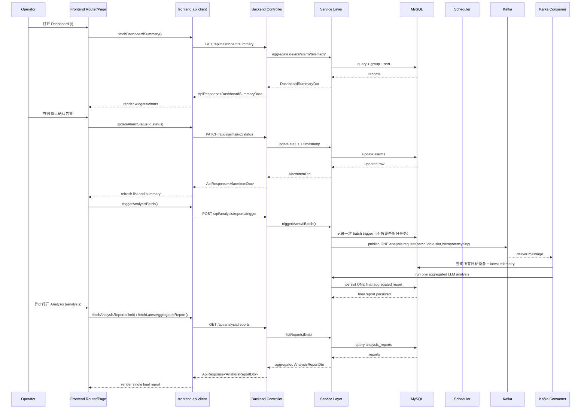

# TwinOps

TwinOps 是面向数据中心的 digital twin 运维系统，核心能力包括设备状态监控、告警流转、资源趋势分析与自动化 AI 报告。
目标是让运维用户在一个 dashboard 中完成「看状态 -> 查设备 -> 处理告警 -> 读分析报告」的完整闭环。

## 技术架构图

```mermaid
flowchart LR
    U[Operator / Browser]

    subgraph FE_LAYER[Frontend Layer - Vue 3 + Vite]
      FE_APP[App Shell<br/>Hash Router]
      FE_DASH[DashboardPage]
      FE_DEV[DeviceDetailPage / DeviceList]
      FE_ANALYSIS[AnalysisCenterPage]
      FE_API[src/api/backend.ts<br/>ApiResponse parser]
      FE_APP --> FE_DASH
      FE_APP --> FE_DEV
      FE_APP --> FE_ANALYSIS
      FE_DASH --> FE_API
      FE_DEV --> FE_API
      FE_ANALYSIS --> FE_API
    end

    subgraph BE_LAYER[Backend Layer - Spring Boot Modular Monolith]
      BE_CTRL[Controller Layer<br/>/api/*]
      BE_AUTH[auth module]
      BE_WATCH[watchlist module]
      BE_DEVICE[device module]
      BE_TELEMETRY[telemetry module]
      BE_ALARM[alarm module]
      BE_DASH[dashboard module]
      BE_ANALYSIS[analysis module]
      BE_SERVICE[Service Layer]
      BE_MAPPER[Mapper Layer<br/>MyBatis-Plus QueryWrapper]
      BE_CTRL --> BE_AUTH
      BE_CTRL --> BE_WATCH
      BE_CTRL --> BE_DEVICE
      BE_CTRL --> BE_TELEMETRY
      BE_CTRL --> BE_ALARM
      BE_CTRL --> BE_DASH
      BE_CTRL --> BE_ANALYSIS
      BE_AUTH --> BE_SERVICE
      BE_WATCH --> BE_SERVICE
      BE_DEVICE --> BE_SERVICE
      BE_TELEMETRY --> BE_SERVICE
      BE_ALARM --> BE_SERVICE
      BE_DASH --> BE_SERVICE
      BE_ANALYSIS --> BE_SERVICE
      BE_SERVICE --> BE_MAPPER
    end

    subgraph DATA_LAYER[Data & Messaging Layer]
      DB[(MySQL<br/>devices / telemetry / alarms / analysis_reports)]
      SCH[@Scheduled<br/>00:00 / 12:00]
      MQ[(Kafka Topic<br/>analysis.request)]
      CON[Kafka Consumer<br/>createReportWithIdempotency]
    end

    U --> FE_APP
    FE_API -->|HTTP JSON| BE_CTRL
    BE_MAPPER --> DB
    SCH -->|publish| MQ
    MQ -->|consume| CON
    CON --> BE_ANALYSIS
    BE_ANALYSIS --> BE_SERVICE
    BE_SERVICE --> BE_MAPPER
```



## 目录结构

- `frontend/`：Vue 应用（Dashboard、Analysis、Device List/Detail）
- `backend/`：Spring Boot API、SQL 初始化脚本、测试
- `openspec/`：需求与变更工件

## 本地部署（直接部署）

### 1) 安装并启动 MySQL 8

```bash
# Ubuntu/Debian
sudo apt-get update
sudo apt-get install -y mysql-server
sudo systemctl enable mysql
sudo systemctl start mysql

# 创建数据库
mysql -uroot -p -e "CREATE DATABASE IF NOT EXISTS twinops DEFAULT CHARSET utf8mb4;"
```

### 2) 安装并启动 Kafka（单机）

```bash
# 安装 JDK17（如未安装）
java -version

# 安装 Kafka（示例用 Apache Kafka 3.x）
wget https://archive.apache.org/dist/kafka/3.8.0/kafka_2.13-3.8.0.tgz
tar -xzf kafka_2.13-3.8.0.tgz
cd kafka_2.13-3.8.0

# 启动 Kafka（KRaft 单节点）
bin/kafka-storage.sh random-uuid > /tmp/kraft-cluster-id
bin/kafka-storage.sh format -t "$(cat /tmp/kraft-cluster-id)" -c config/kraft/server.properties
nohup bin/kafka-server-start.sh config/kraft/server.properties > logs/server.log 2>&1 &

# 创建分析 topic
bin/kafka-topics.sh --bootstrap-server 127.0.0.1:9092 --create --topic analysis.request --partitions 1 --replication-factor 1
```

### 3) 初始化数据库

```bash
mysql -h 127.0.0.1 -P 3306 -uroot -proot twinops < backend/sql/001_schema.sql
mysql -h 127.0.0.1 -P 3306 -uroot -proot twinops < backend/sql/002_seed_devices.sql
mysql -h 127.0.0.1 -P 3306 -uroot -proot twinops < backend/sql/003_seed_metrics.sql
mysql -h 127.0.0.1 -P 3306 -uroot -proot twinops < backend/sql/004_seed_alarms.sql
mysql -h 127.0.0.1 -P 3306 -uroot -proot twinops < backend/sql/005_verify_retention.sql
```

### 4) 启动后端

```bash
cd backend
mvn -DskipTests package
java -jar target/backend-0.0.1-SNAPSHOT.jar
```

Backend 默认地址：`http://127.0.0.1:8080`

### 5) 启动前端

```bash
cd frontend
npm ci
npm run build
npm run preview
```

Frontend 默认预览地址：`http://127.0.0.1:4173`

### Docker 备选方案（仅在本机未安装 MySQL/Kafka 时使用）

```bash
# 1) 启动 MySQL 容器
docker run -d --name twinops-mysql -e MYSQL_ROOT_PASSWORD=root -e MYSQL_DATABASE=twinops -p 3306:3306 mysql:8.0

# 2) 启动 Kafka
docker run -d --name twinops-kafka -p 9092:9092 apache/kafka:3.8.0

# 3) 初始化数据库（在宿主机执行）
mysql -h 127.0.0.1 -P 3306 -uroot -proot twinops < backend/sql/001_schema.sql
mysql -h 127.0.0.1 -P 3306 -uroot -proot twinops < backend/sql/002_seed_devices.sql
mysql -h 127.0.0.1 -P 3306 -uroot -proot twinops < backend/sql/003_seed_metrics.sql
mysql -h 127.0.0.1 -P 3306 -uroot -proot twinops < backend/sql/004_seed_alarms.sql
mysql -h 127.0.0.1 -P 3306 -uroot -proot twinops < backend/sql/005_verify_retention.sql
```

## 生产部署

### Backend

```bash
cd backend
mvn -DskipTests package
java -jar target/backend-0.0.1-SNAPSHOT.jar > backend.log 2>&1
```

### Frontend

```bash
cd frontend
npm ci
npm run build
npm run dev
```

将 `frontend/docs` 作为静态目录部署到 Nginx，并将 `/api/*` reverse proxy 到 `http://127.0.0.1:8080`。

## 启动后验证

```bash
# 先登录获取 token（按实际返回提取 token）
curl -X POST "http://127.0.0.1:8080/api/auth/login" \
  -H "Content-Type: application/json" \
  -d '{"username":"admin","password":"admin123456"}'

# 受保护接口访问需要携带 Authorization: Bearer <token>
curl "http://127.0.0.1:8080/api/dashboard/summary" \
  -H "Authorization: Bearer <token>"
curl "http://127.0.0.1:8080/api/analysis/reports?limit=20" \
  -H "Authorization: Bearer <token>"

# Analysis Center 一键触发分析（异步，无需传 deviceCode）
curl -X POST "http://127.0.0.1:8080/api/analysis/reports/trigger" \
  -H "Authorization: Bearer <token>"
```

## Analysis Center 触发流程（Kafka 对齐）

- 前端 Analysis Center 仅提供“一键触发”，不再要求用户输入 `deviceCode` 或 `metricSummary`。
- Backend `POST /api/analysis/reports/trigger` 执行 `triggerManualBatch()`：
  - Producer 只写入 **1 条** Kafka job 到 `analysis.request`（batch job）；
  - Consumer 消费该 job 后，统一查询全部目标 device + telemetry；
  - Consumer 只执行 **1 次** LLM analysis，并持久化 **1 条**最终聚合报告。
- 前端通过异步查询（列表或 latest 接口）获取并展示该 single final report。
- 整体链路为 `Frontend click trigger -> Producer ONE job -> Consumer aggregated query -> ONE LLM analysis -> ONE final report -> Frontend async fetch`。

## 工程质量策略

- 任何后续代码变更（功能、修复、重构、配置）必须同时补充：
  - Integration Tests（集成测试）
  - Regression Tests（回归测试）

## Backend Logging Baseline（从本次 change 起强制执行）

- 后续所有 backend 代码变更都必须在关键路径补齐日志（Controller/Service/Auth/Kafka），不能仅依赖异常堆栈被动排查。
- 日志等级必须使用并区分 `info`、`warn`、`error`：
  - `info`：请求入口、关键步骤开始/成功；
  - `warn`：可恢复异常、边界输入、空结果、兼容分支；
  - `error`：不可恢复失败、关键依赖异常、主流程中断。
- 日志必须可定位代码来源（class/method/line），保证开发排障时可以直接定位日志打印位置。
- 结构化字段保持统一：`request_id`、`module`、`event`、`result`、`error_code`（按需带 `latency_ms`）。

验证页面：

- Dashboard：`http://127.0.0.1:4173/#/`
- Analysis：`http://127.0.0.1:4173/#/analysis`
- Devices：`http://127.0.0.1:4173/#/devices`
- Swagger UI：`http://127.0.0.1:8080/swagger-ui/index.html`

## 详细文档

- Backend API/配置：[`backend/README.md`](backend/README.md)
- Frontend 页面与脚本：[`frontend/README.md`](frontend/README.md)
