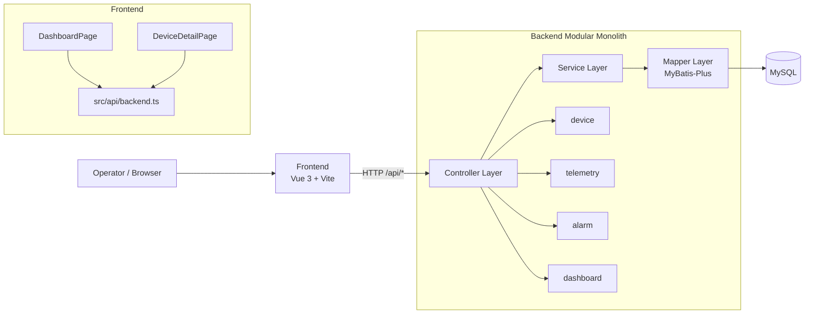

# TwinOps

TwinOps 是一个面向数据中心场景的 digital twin 运维平台，提供 3D 可视化、设备状态观测、告警追踪与指标分析能力。项目采用前后端分离架构，围绕统一的数据契约与模块化边界实现从数据入库到业务展示的闭环。

## 项目概览

TwinOps 由 `frontend`、`backend`、`openspec` 三个核心部分组成：

- `frontend`：基于 Vue 3 + Vite 的可视化应用，负责 dashboard、设备详情页、3D scene 与图表渲染。
- `backend`：基于 Spring Boot + MyBatis-Plus + MySQL 的 API 服务，负责设备、遥测、告警与聚合数据接口。
- `openspec`：需求与变更工件管理目录，沉淀 proposal/design/specs/tasks 与归档记录。

核心业务流为：MySQL seeded data 与实时数据进入 backend domain service，经 API 输出标准响应，再由 frontend 完成 UI 组合与交互呈现。

## Repository Layout

- `frontend/`：前端源码、构建配置、脚本与静态资源
- `backend/`：后端服务、SQL 初始化脚本、测试代码
- `openspec/`：OpenSpec change artifacts 与 specs
- `.github/workflows/frontend-ci.yml`：frontend CI（`npm ci` + `type-check` + `build`）

## 技术实现方案（Technical Implementation Plan）

### 0) 系统架构图（Architecture Diagram）



### 1) 架构分层与模块职责

- 前端采用 page + component + hook 结构，路由基于 hash mode，主路径包含 `/`（dashboard）与 `/devices`（设备详情）。
- 后端采用 modular monolith 组织方式，领域模块包含 `device`、`telemetry`、`alarm`、`dashboard`，并通过 `Controller -> Service -> Mapper(BaseMapper)` 完成数据访问与业务编排。
- 数据库层使用 MySQL，初始化脚本位于 `backend/sql`，按 schema/seed/verify 顺序执行，保证 demo 与开发环境可重复初始化。

### 2) 前后端契约与数据流

- API 统一返回 `ApiResponse<T> { success, message, data }`，frontend 的 `src/api/backend.ts` 按该 contract 进行解析与异常抛出。
- 领域 DTO 字段命名与 frontend 消费保持一致（如 `deviceCode`、`faultRate`、`resourceUsage`），避免 ad-hoc 字段转换导致语义漂移。
- backend 查询风格统一使用 `QueryWrapper`，并在 service 层明确排序与 limit 规则，保证 dashboard 与列表视图可预测性。
- 告警工作流支持前端状态流转：`new -> acknowledged -> resolved`，并通过 `PATCH /api/alarms/{id}/status` 回写 backend。

### 3) 性能与运行时策略

- frontend 对 Three.js addon 与 ECharts runtime 使用 lazy loading / deferred loading，降低 initial bundle 体积并减少首屏阻塞。
- Vite 构建采用 manual chunking 策略；生产构建输出用于静态部署并通过 reverse proxy 转发 `/api/*`。
- 非关键模块加载失败时采用 local fallback UI/logging，避免单点异常导致整页不可用。

### 4) 工程与交付策略

- 前端脚本在 `frontend` workspace 执行，CI 显式配置 `working-directory: frontend`。
- 后端接口使用 `/api/*` 路径，并保持与 frontend 环境变量（如 `VITE_BACKEND_BASE_URL`）对齐。
- OpenSpec 作为变更治理入口：先定义 `proposal/design/specs/tasks`，再实施、验证与归档，保证需求可追溯。

### 5) 稳定性优先实现策略（Stability-first）

1. 接口复用优先：优先复用既有 API（如 `GET /api/alarms`、`PATCH /api/alarms/{id}/status`），避免无必要 backend 扩面。  
2. 增量交付优先：以小步可回滚的前端改造推进功能（告警工作流、summary 刷新、设备筛选）。  
3. 一致性优先：dashboard summary 采用 shared fetch，避免多组件并发请求造成数据快照不一致。  
4. 明确错误反馈：对请求失败提供可见错误提示与状态回滚，避免“成功假象”。  

## 开发环境与依赖

### Frontend

- Node.js 20+（建议与 CI 对齐）
- 包管理：npm

### Backend

- Java 17+
- Maven 3.9+
- MySQL 8+

## Frontend Quick Start

```bash
cd frontend
npm install
npm run dev
```

## Frontend Build and Preview

在 `frontend` 目录执行：

```bash
npm run type-check
npm run build
npm run preview
```

可选质量命令：

```bash
npm run lint
npm run lint:style
npm run format
```

## 前端新增交互能力（稳定性优先）

- Dashboard 支持 **手动刷新** summary 数据，并展示“最近更新时间”。
- 告警面板支持状态筛选：`new / acknowledged / resolved`。
- 告警面板支持状态操作：`new -> acknowledged`、`acknowledged -> resolved`。
- 设备详情页支持按 `name/deviceCode` 搜索，并支持按 `status(normal/warning/error)` 过滤。

## Backend Quick Start

在 `backend` 目录执行：

```bash
mvn test -DskipITs
mvn spring-boot:run
```

默认服务地址：`http://127.0.0.1:8080`

## 部署与运行流程

推荐部署顺序：`MySQL -> Backend -> Frontend`

### 1. 初始化数据库

```sql
CREATE DATABASE IF NOT EXISTS twinops DEFAULT CHARSET utf8mb4;
```

按顺序执行：

1. `backend/sql/001_schema.sql`
2. `backend/sql/002_seed_devices.sql`
3. `backend/sql/003_seed_metrics.sql`
4. `backend/sql/004_seed_alarms.sql`
5. `backend/sql/005_verify_retention.sql`（可选）

### 2. 启动 Backend

```bash
cd backend
mvn spring-boot:run
```

可选环境变量：

- `DB_URL`（默认：`jdbc:mysql://127.0.0.1:3306/twinops?useUnicode=true&characterEncoding=UTF-8&serverTimezone=UTC`）
- `DB_USERNAME`（默认：`root`）
- `DB_PASSWORD`（默认：`root`）
- `SERVER_PORT`（默认：`8080`）

### 3. 启动 Frontend

```bash
cd frontend
npm install
npm run dev
```

如需指定 backend 地址：

- `VITE_BACKEND_BASE_URL=http://127.0.0.1:8080`

### 4. End-to-End 验证

- frontend 页面可正常加载与路由切换。
- backend API 返回 seeded records。
- 设备详情、告警面板、dashboard 图表由 backend 数据驱动。
- 在 dashboard 执行“刷新看板”后，更新时间发生变化且设备规模/故障变化率数据保持一致刷新。
- 在告警面板切换状态 tabs，并执行确认/解决动作后，列表状态与筛选结果正确更新。
- 在设备详情页输入关键词与状态过滤后，列表数量与卡片内容匹配筛选条件。

## 生产构建（Simple）

### Backend

```bash
cd backend
mvn -DskipTests package
java -jar target/backend-0.0.1-SNAPSHOT.jar
```

### Frontend

```bash
cd frontend
npm ci
npm run build
```

将构建产物作为静态资源部署（如 Nginx/CDN），并将 `/api/*` reverse proxy 到 backend 服务。

## OpenSpec Workflow

常用命令：

- `openspec new change "<change-name>"`
- `openspec status --change "<change-name>"`
- `openspec instructions apply --change "<change-name>"`
- `openspec apply --change "<change-name>"`
- `openspec archive "<change-name>" -y`

Copilot CLI 可直接调用技能命令：

- `/openspec-new-change`
- `/openspec-ff-change`
- `/openspec-apply-change`
- `/openspec-verify-change`
- `/openspec-archive-change`

## Migration and Rollback

- Migration notes: `openspec/changes/archive/2026-03-29-restructure-frontend-folder/migration-notes.md`
- Rollback script: `rollback-frontend.ps1`

## Notes

- 本地可视化测试生成的截图文件已在根目录与 `frontend` 目录的 `.gitignore` 中忽略。
- OpenSpec/opsx scratch 文件与 backend 构建产物在仓库根目录已做忽略处理。
