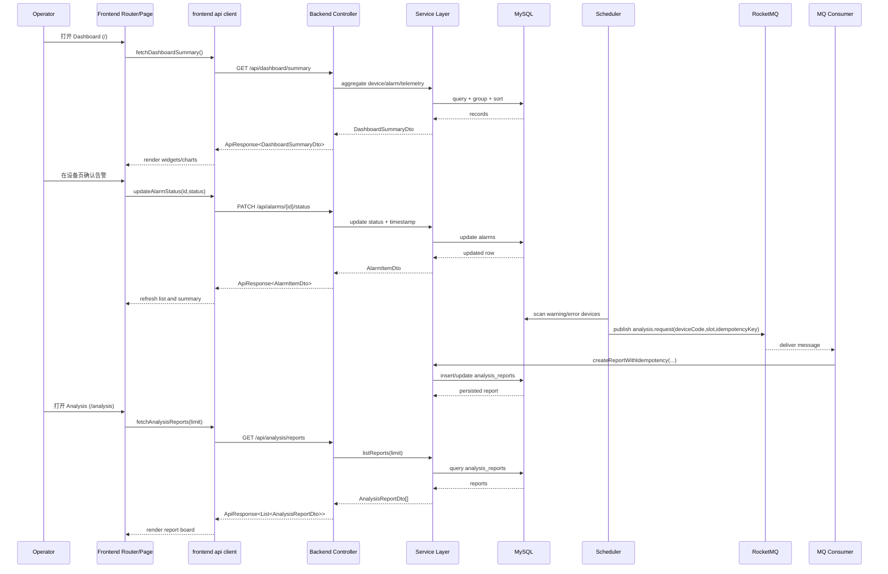

# TwinOps

TwinOps 是面向数据中心的 digital twin 运维系统，核心能力包括设备状态监控、告警流转、资源趋势分析与自动化 AI 报告。
目标是让运维用户在一个 dashboard 中完成「看状态 -> 查设备 -> 处理告警 -> 读分析报告」的完整闭环。

## 技术架构图

```mermaid
flowchart LR
    U[Operator / Browser]

    subgraph FE_LAYER[Frontend Layer - Vue 3 + Vite]
      FE_APP[App Shell<br/>Hash Router]
      FE_DASH[DashboardPage]
      FE_DEV[DeviceDetailPage / DeviceList]
      FE_ANALYSIS[AnalysisCenterPage]
      FE_API[src/api/backend.ts<br/>ApiResponse parser]
      FE_APP --> FE_DASH
      FE_APP --> FE_DEV
      FE_APP --> FE_ANALYSIS
      FE_DASH --> FE_API
      FE_DEV --> FE_API
      FE_ANALYSIS --> FE_API
    end

    subgraph BE_LAYER[Backend Layer - Spring Boot Modular Monolith]
      BE_CTRL[Controller Layer<br/>/api/*]
      BE_AUTH[auth module]
      BE_DEVICE[device module]
      BE_ALARM[alarm module]
      BE_DASH[dashboard module]
      BE_ANALYSIS[analysis module]
      BE_SERVICE[Service Layer]
      BE_MAPPER[Mapper Layer<br/>MyBatis-Plus QueryWrapper]
      BE_CTRL --> BE_AUTH
      BE_CTRL --> BE_DEVICE
      BE_CTRL --> BE_ALARM
      BE_CTRL --> BE_DASH
      BE_CTRL --> BE_ANALYSIS
      BE_AUTH --> BE_SERVICE
      BE_DEVICE --> BE_SERVICE
      BE_ALARM --> BE_SERVICE
      BE_DASH --> BE_SERVICE
      BE_ANALYSIS --> BE_SERVICE
      BE_SERVICE --> BE_MAPPER
    end

    subgraph DATA_LAYER[Data & Messaging Layer]
      DB[(MySQL<br/>devices / telemetry / alarms / analysis_reports)]
      SCH[@Scheduled<br/>00:00 / 12:00]
      MQ[(RocketMQ<br/>analysis.request)]
      CON[Consumer<br/>createReportWithIdempotency]
    end

    U --> FE_APP
    FE_API -->|HTTP JSON| BE_CTRL
    BE_MAPPER --> DB
    SCH -->|publish| MQ
    MQ -->|consume| CON
    CON --> BE_ANALYSIS
    BE_ANALYSIS --> BE_SERVICE
    BE_SERVICE --> BE_MAPPER
```



## 目录结构

- `frontend/`：Vue 应用（Dashboard、Analysis、Device List/Detail）
- `backend/`：Spring Boot API、SQL 初始化脚本、测试
- `openspec/`：需求与变更工件

## 本地部署（直接部署）

### 1) 安装并启动 MySQL 8

```bash
# Ubuntu/Debian
sudo apt-get update
sudo apt-get install -y mysql-server
sudo systemctl enable mysql
sudo systemctl start mysql

# 创建数据库
mysql -uroot -p -e "CREATE DATABASE IF NOT EXISTS twinops DEFAULT CHARSET utf8mb4;"
```

### 2) 安装并启动 RocketMQ（NameServer + Broker）

```bash
# 安装 JDK17（如未安装）
java -version

# 下载并解压 RocketMQ（示例 5.3.2）
wget https://archive.apache.org/dist/rocketmq/5.3.2/rocketmq-all-5.3.2-bin-release.zip
unzip rocketmq-all-5.3.2-bin-release.zip
cd rocketmq-all-5.3.2-bin-release

# 启动 NameServer
nohup sh bin/mqnamesrv > logs/namesrv.log 2>&1 &

# 启动 Broker（单机）
nohup sh bin/mqbroker -n 127.0.0.1:9876 --enable-proxy > logs/broker.log 2>&1 &
```

### 3) 初始化数据库

```bash
mysql -h 127.0.0.1 -P 3306 -uroot -proot twinops < backend/sql/001_schema.sql
mysql -h 127.0.0.1 -P 3306 -uroot -proot twinops < backend/sql/002_seed_devices.sql
mysql -h 127.0.0.1 -P 3306 -uroot -proot twinops < backend/sql/003_seed_metrics.sql
mysql -h 127.0.0.1 -P 3306 -uroot -proot twinops < backend/sql/004_seed_alarms.sql
mysql -h 127.0.0.1 -P 3306 -uroot -proot twinops < backend/sql/005_verify_retention.sql
```

### 4) 启动后端

```bash
cd backend
mvn -DskipTests package
java -jar target/backend-0.0.1-SNAPSHOT.jar
```

Backend 默认地址：`http://127.0.0.1:8080`

### 5) 启动前端

```bash
cd frontend
npm ci
npm run build
npm run preview
```

Frontend 默认预览地址：`http://127.0.0.1:4173`

### Docker 备选方案（仅在本机未安装 MySQL/RocketMQ 时使用）

```bash
# 1) 启动 MySQL 容器
docker run -d --name twinops-mysql -e MYSQL_ROOT_PASSWORD=root -e MYSQL_DATABASE=twinops -p 3306:3306 mysql:8.0

# 2) 启动 RocketMQ NameServer + Broker
docker run -d --name rmqnamesrv -p 9876:9876 apache/rocketmq:5.3.2 sh mqnamesrv
docker run -d --name rmqbroker --link rmqnamesrv:namesrv -e "NAMESRV_ADDR=namesrv:9876" -p 10911:10911 -p 10909:10909 apache/rocketmq:5.3.2 sh mqbroker -n namesrv:9876 --enable-proxy

# 3) 初始化数据库（在宿主机执行）
mysql -h 127.0.0.1 -P 3306 -uroot -proot twinops < backend/sql/001_schema.sql
mysql -h 127.0.0.1 -P 3306 -uroot -proot twinops < backend/sql/002_seed_devices.sql
mysql -h 127.0.0.1 -P 3306 -uroot -proot twinops < backend/sql/003_seed_metrics.sql
mysql -h 127.0.0.1 -P 3306 -uroot -proot twinops < backend/sql/004_seed_alarms.sql
mysql -h 127.0.0.1 -P 3306 -uroot -proot twinops < backend/sql/005_verify_retention.sql
```

## 生产部署

### Backend

```bash
cd backend
mvn -DskipTests package
nohup java -jar target/backend-0.0.1-SNAPSHOT.jar > backend.log 2>&1 &
```

### Frontend

```bash
cd frontend
npm ci
npm run build
npm run dev
```

将 `frontend/docs` 作为静态目录部署到 Nginx，并将 `/api/*` reverse proxy 到 `http://127.0.0.1:8080`。

## 启动后验证

```bash
curl "http://127.0.0.1:8080/api/dashboard/summary"
curl "http://127.0.0.1:8080/api/analysis/reports?limit=20"
```

验证页面：

- Dashboard：`http://127.0.0.1:4173/#/`
- Analysis：`http://127.0.0.1:4173/#/analysis`
- Devices：`http://127.0.0.1:4173/#/devices`

## 详细文档

- Backend API/配置：[`backend/README.md`](backend/README.md)
- Frontend 页面与脚本：[`frontend/README.md`](frontend/README.md)
