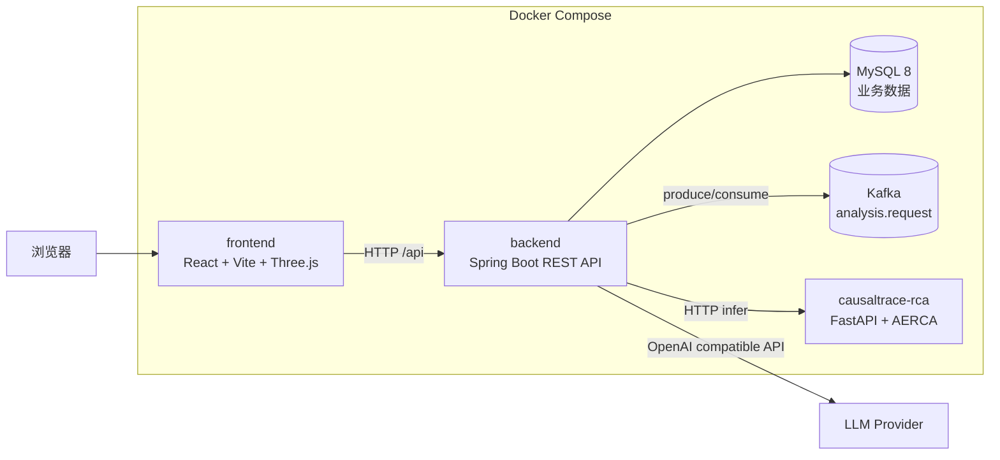
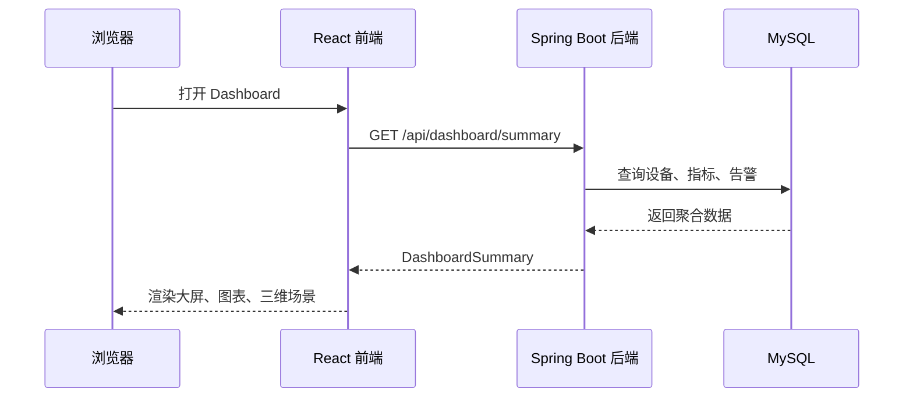
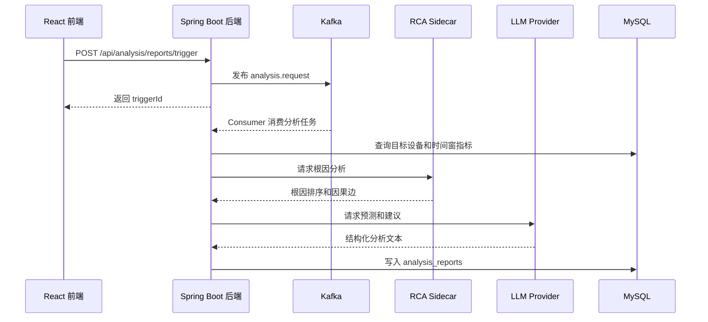

# TwinOps 数据中心数字孪生智能运维平台

TwinOps 是一套面向数据中心设备运维的数字孪生与智能分析平台。它把机房三维可视化、设备健康监控、告警处理、聚合分析、LLM 文本分析和设备级 RCA 根因分析串成一条运维闭环，目标是让运维人员快速看到问题、定位影响范围并得到可执行建议。

本文只保留一种安装部署方式：**Linux 服务器上的 Docker Compose 部署**。宿主机不需要单独安装 JDK、Node.js、Maven 或 Python，这些依赖应由镜像构建阶段处理。

## 目录

- [项目定位](#项目定位)
- [设计架构](#设计架构)
- [模块说明](#模块说明)
- [核心流程](#核心流程)
- [技术栈](#技术栈)
- [Linux Docker 部署](#linux-docker-部署)
- [访问入口](#访问入口)
- [常用接口](#常用接口)
- [目录结构](#目录结构)
- [故障排查](#故障排查)
- [开源协议](#开源协议)

## 项目定位

TwinOps 解决的是数据中心设备多、指标多、告警多时的定位效率问题：

- 前端提供数据中心数字孪生大屏、设备列表、设备详情、告警面板和分析中心。
- 后端提供统一 REST API、管理员鉴权、设备/指标/告警/关注列表管理、分析任务编排和报告持久化。
- Kafka 承接分析触发事件，让手动触发和定时触发都走同一条分析流水线。
- MySQL 保存设备、遥测指标、告警、关注列表和分析报告。
- RCA sidecar 作为独立 Python 服务运行 AERCA 根因分析模型；不可用时后端降级为 LLM 或本地 mock 分析。
- LLM 通过 OpenAI 兼容接口生成预测描述、风险等级和建议动作。

## 设计架构



### 架构分层

| 层级 | 目录/服务 | 职责 |
| --- | --- | --- |
| 表现层 | `frontend` | 页面路由、登录态、Dashboard、设备详情、分析中心、Three.js 设备场景、ECharts 图表 |
| API 层 | `backend/*/controller` | 对外暴露 REST API，统一返回 `ApiResponse`，处理登录、设备、告警、指标、分析等请求 |
| 业务层 | `backend/*/service` | 鉴权、设备聚合、告警状态变更、关注列表、Dashboard 汇总、分析任务编排、RCA payload 组装 |
| 数据访问层 | `backend/*/mapper` | MyBatis-Plus Mapper，访问 MySQL 表 |
| 异步分析层 | `backend/analysis/service` + Kafka | 发布和消费 `analysis.request`，生成聚合分析报告 |
| RCA 推理层 | `causaltrace-rca/service` | FastAPI sidecar，加载 AERCA 模型并返回根因排序和因果边 |
| 数据层 | MySQL | `devices`、`device_metrics`、`alarms`、`analysis_reports`、`admin_watchlist` |

### 后端包职责

| 包 | 作用 |
| --- | --- |
| `auth` | 管理员登录、token 解析、接口拦截、Swagger 白名单 |
| `dashboard` | 大屏汇总数据、故障率趋势、资源使用趋势 |
| `device` | 设备列表、设备详情、三维场景设备数据、仿真模型与数据库一致性检查 |
| `telemetry` | 设备遥测数据查询和保留策略 |
| `alarm` | 告警列表、按设备过滤、告警状态处理 |
| `watchlist` | 管理员关注设备列表 |
| `analysis` | 手动触发分析、Kafka 自动化、RCA 调用、LLM 预测、报告持久化 |
| `common` | 统一响应、异常处理、结构化日志、请求关联 ID |

## 模块说明

### 前端

前端是 React 19 + TypeScript + Vite 应用。`frontend/src/api/backend.ts` 是后端 API 的统一客户端，默认请求后端 `http://127.0.0.1:8080`，Docker 部署时应通过 `VITE_BACKEND_BASE_URL` 在构建阶段指定公网或内网 API 地址。

关键页面：

- `DashboardPage`：设备状态、告警、故障率趋势和三维场景。
- `DeviceDetailPage`：单设备指标、告警和关注状态。
- `AnalysisCenterPage`：分析报告列表、手动触发聚合分析。
- `LoginPage`：管理员登录。

### 后端

后端是 Spring Boot 3.3 模块化单体。它不是微服务拆分，但代码按业务边界拆包，便于后续拆分服务。

主要外部依赖：

- MySQL：业务数据持久化。
- Kafka：分析任务事件流。
- RCA sidecar：可选根因分析增强。
- LLM Provider：OpenAI 兼容接口；失败时可 fallback 到 mock。

### RCA Sidecar

`causaltrace-rca` 是独立 Python FastAPI 服务，接口包括：

- `GET /health`
- `POST /infer/device-rca`

后端通过 `twinops.analysis.rca.*` 配置调用它。若模型文件缺失、服务不可达或调用失败，后端会记录 fallback 日志并继续生成分析报告。

## 核心流程

### Dashboard 数据流



### 聚合分析流程



## 技术栈

| 类型 | 技术 |
| --- | --- |
| 前端 | React 19、TypeScript、Vite、Three.js、ECharts |
| 后端 | Java 17、Spring Boot 3.3、MyBatis-Plus、Spring Kafka、LangChain4j |
| RCA | Python 3.11、FastAPI、AERCA、PyTorch CPU/GPU |
| 数据库 | MySQL 8 |
| 消息队列 | Kafka 3.x |
| 部署 | Linux、Docker Engine、Docker Compose v2 |

## Linux Docker 部署

以下命令在 Linux 服务器上执行即可完成部署。仓库已提供 `docker-compose.yml`、`backend/Dockerfile`、`frontend/Dockerfile` 和 `causaltrace-rca/Dockerfile`，不需要开发者再手写部署文件。

### 1. 安装 Docker

```bash
curl -fsSL https://get.docker.com | sudo sh
sudo usermod -aG docker "$USER"
newgrp docker

docker version
docker compose version
```

### 2. 拉取项目

```bash
git clone https://github.com/zzulfy/TwinOps.git
cd TwinOps
```

### 3. 检查部署配置

部署配置已经写入仓库文件，正常情况下可以直接启动。需要改端口、数据库密码、管理员账号、LLM 或 RCA 时，修改下表对应文件即可。

| 文件 | 作用 | 常改项 |
| --- | --- | --- |
| `docker-compose.yml` | 容器编排、端口、MySQL/Kafka 容器环境 | `8080:8080`、`8090:80`、`MYSQL_PASSWORD`、前端 `VITE_BACKEND_BASE_URL` |
| `backend/src/main/resources/application.yml` | 后端主配置，Spring Boot 默认读取 | 数据库连接、管理员账号、Kafka、RCA、仿真模型路径 |
| `backend/src/main/resources/llm.yml` | LLM 配置，由 `application.yml` 中 `spring.config.import` 引入 | `base-url`、`api-key`、`model`、`fallback-to-mock` |
| `backend/src/main/resources/application.example.yml` | 参考配置模板 | 对照查看默认配置结构 |
| `backend/src/main/resources/llm.example.yml` | LLM 参考配置模板 | 对照查看 LLM 配置结构 |

默认登录账号写在 `application.yml`：

- 用户名：`admin`
- 密码：`admin123456`

生产部署前建议至少修改 `docker-compose.yml` 中的 MySQL 密码，并同步修改 `application.yml` 中的 `spring.datasource.password`。如果前端不是在部署机本机访问，把 `docker-compose.yml` 中的 `VITE_BACKEND_BASE_URL` 改成浏览器可访问的后端地址，例如 `http://<服务器IP>:8080`。

### 4. 构建并启动

```bash
docker compose up -d --build
docker compose ps
```

首次启动时 MySQL 会挂载整个 `backend/sql` 目录，并按文件名顺序自动执行其中所有 `.sql` 文件：

- `001_schema.sql`：创建表结构。
- `002_add_analysis_columns.sql`：幂等补齐分析报告 RCA 字段。
- `002_add_analysis_columns_compat.sql`：兼容迁移脚本，重复执行时会因字段已存在而跳过。
- `002_seed_devices.sql`：写入设备种子数据。
- `003_seed_metrics.sql`：写入遥测指标种子数据。
- `004_seed_alarms.sql`：写入告警种子数据。
- `005_verify_retention.sql`：执行初始化后的数据一致性检查。

注意：MySQL 官方镜像只会在数据库数据目录为空时执行 `/docker-entrypoint-initdb.d`。如果已经启动过并保留了 `mysql-data` 数据卷，新增或修改 SQL 后需要执行 `docker compose down -v && docker compose up -d --build` 才会重新导入。

Kafka topic `analysis.request` 会由 `kafka-init` 服务自动创建。

### 5. 查看启动日志

```bash
docker compose logs --tail=120 mysql
docker compose logs --tail=120 kafka
docker compose logs --tail=120 backend
docker compose logs --tail=120 frontend
```

### 6. 验证部署

```bash
TOKEN="$(
  curl -fsS -X POST "http://127.0.0.1:8080/api/auth/login" \
    -H "Content-Type: application/json" \
    -d '{"username":"admin","password":"admin123456"}' \
  | sed -n 's/.*"token":"\([^"]*\)".*/\1/p'
)"

test -n "$TOKEN" && echo "login ok"

curl -fsS "http://127.0.0.1:8080/api/auth/me" \
  -H "Authorization: Bearer ${TOKEN}"

curl -fsS "http://127.0.0.1:8080/api/analysis/health" \
  -H "Authorization: Bearer ${TOKEN}"

curl -fsSI "http://127.0.0.1:8090/" | head -n 1

docker compose exec mysql mysql -utwinops -ptwinops123456 twinops \
  -e 'SELECT COUNT(*) AS devices FROM devices; SELECT COUNT(*) AS metrics FROM device_metrics; SELECT COUNT(*) AS alarms FROM alarms;'
```

期望结果：

- `docker compose ps` 中 `mysql`、`kafka`、`backend`、`frontend` 为运行状态。
- `/api/auth/me` 返回当前管理员信息。
- `/api/analysis/health` 返回 Kafka listener 和 topic 检查结果。
- 前端首页返回 `HTTP/1.1 200 OK` 或 `HTTP/1.1 304 Not Modified`。
- MySQL 行数为：`devices=32`、`metrics=1536`、`alarms=4`。

### 7. 触发一次分析任务

```bash
curl -fsS -X POST "http://127.0.0.1:8080/api/analysis/reports/trigger" \
  -H "Authorization: Bearer ${TOKEN}"

sleep 5

curl -fsS "http://127.0.0.1:8080/api/analysis/reports?limit=5" \
  -H "Authorization: Bearer ${TOKEN}"
```

### 8. 停止、重启、重置

```bash
# 停止服务，保留数据库和 Kafka 数据
docker compose down

# 重新启动
docker compose up -d

# 完全重置数据后重新部署
docker compose down -v
docker compose up -d --build
```

### 9. 启用 RCA Sidecar

默认部署不启用 RCA，因为 AERCA 模型文件通常不会直接提交到仓库。已有模型文件时，把模型放到 `causaltrace-rca/saved_models/`，然后执行：

```bash
mkdir -p causaltrace-rca/saved_models
sed -i '/^[[:space:]]*rca:/,/^[[:space:]]*simulation:/ s/enabled: false/enabled: true/' backend/src/main/resources/application.yml
docker compose --profile rca up -d --build
docker compose logs --tail=120 rca
```

RCA 不可用时，后端会自动 fallback，不会阻断分析报告生成。

### 10. 服务器防火墙

如果服务器开启了防火墙，放行前端和后端端口：

```bash
sudo ufw allow 8090/tcp
sudo ufw allow 8080/tcp
sudo ufw status
```

CentOS/Rocky Linux 使用 firewalld：

```bash
sudo firewall-cmd --permanent --add-port=8090/tcp
sudo firewall-cmd --permanent --add-port=8080/tcp
sudo firewall-cmd --reload
```

## Docker 部署文件

| 文件 | 作用 |
| --- | --- |
| `docker-compose.yml` | 编排 MySQL、Kafka、后端、前端和可选 RCA sidecar |
| `backend/src/main/resources/application.yml` | 后端主配置 |
| `backend/src/main/resources/llm.yml` | 后端 LLM 配置 |
| `backend/Dockerfile` | 使用 Maven 构建 Spring Boot Jar，并复制 SQL 与三维模型 |
| `frontend/Dockerfile` | 使用 Node 构建 Vite 静态资源，再用 Nginx 提供访问 |
| `frontend/nginx.conf` | 前端静态资源和 SPA fallback 配置 |
| `causaltrace-rca/Dockerfile` | 构建 FastAPI + AERCA RCA sidecar 镜像 |

## 访问入口

| 入口 | 默认地址 | 说明 |
| --- | --- | --- |
| 前端页面 | `http://<服务器IP>:8090` | 访问 Dashboard、设备详情、分析中心 |
| 后端 API | `http://<服务器IP>:8080` | REST API |
| Swagger UI | `http://<服务器IP>:8080/swagger-ui/index.html` | API 调试 |
| OpenAPI JSON | `http://<服务器IP>:8080/v3/api-docs` | 接口元数据 |

## 常用接口

先登录并写入 `TOKEN`：

```bash
TOKEN="$(
  curl -fsS -X POST "http://127.0.0.1:8080/api/auth/login" \
    -H "Content-Type: application/json" \
    -d '{"username":"admin","password":"admin123456"}' \
  | sed -n 's/.*"token":"\([^"]*\)".*/\1/p'
)"
```

再调用业务接口：

```bash
# 当前登录用户
curl -fsS "http://127.0.0.1:8080/api/auth/me" \
  -H "Authorization: Bearer ${TOKEN}"

# 查询设备列表
curl -fsS "http://127.0.0.1:8080/api/devices" \
  -H "Authorization: Bearer ${TOKEN}"

# 查询 Dashboard 汇总
curl -fsS "http://127.0.0.1:8080/api/dashboard/summary" \
  -H "Authorization: Bearer ${TOKEN}"

# 查询分析流水线健康状态
curl -fsS "http://127.0.0.1:8080/api/analysis/health" \
  -H "Authorization: Bearer ${TOKEN}"

# 触发聚合分析
curl -fsS -X POST "http://127.0.0.1:8080/api/analysis/reports/trigger" \
  -H "Authorization: Bearer ${TOKEN}"
```

## 目录结构

```text
TwinOps/
├─ docker-compose.yml      # Linux Docker Compose 编排文件
├─ backend/                # Spring Boot 后端
│  ├─ Dockerfile
│  ├─ src/main/java/       # controller/service/mapper/entity/dto
│  ├─ src/main/resources/  # Docker 配置与本地配置模板
│  └─ sql/                 # schema、种子数据、迁移脚本
├─ frontend/               # React + Vite 前端
│  ├─ Dockerfile
│  ├─ nginx.conf
│  ├─ src/                 # 页面、组件、hooks、API client
│  ├─ public/              # 静态资源、三维模型、字体、贴图
│  └─ docs/                # Vite 构建输出目录
├─ causaltrace-rca/         # AERCA 根因分析和 FastAPI sidecar
│  └─ Dockerfile
├─ openspec/               # 需求、设计和变更规范
├─ reports/                # 截图和验证产物
└─ README.md               # 本文档
```

## 故障排查

| 现象 | 处理 |
| --- | --- |
| `docker compose up` 拉取镜像失败 | 检查服务器网络和 Docker registry 访问；国内环境可配置镜像加速 |
| `docker-credential-desktop.exe: exec format error` | WSL/Linux 读取了 Docker Desktop 的 Windows 凭据助手。执行 `cp ~/.docker/config.json ~/.docker/config.json.bak` 备份后，把 `~/.docker/config.json` 改为 `{"auths":{}}`，再重新执行 `docker compose up -d --build` |
| 前端页面能打开但接口失败 | 检查 `docker-compose.yml` 中前端构建参数 `VITE_BACKEND_BASE_URL` 是否是浏览器可访问地址，修改后执行 `docker compose up -d --build frontend` |
| 后端数据库连接失败 | 执行 `docker compose logs --tail=120 mysql backend`，检查 `docker-compose.yml` 与 `application.yml` 中数据库名称、用户和密码是否一致 |
| 分析健康检查显示 Kafka 不可达 | 执行 `docker compose logs --tail=120 kafka kafka-init backend`，确认 `analysis.request` topic 已创建 |
| 登录后请求 401 | 后端 token 存在进程内存中，后端重启后需要重新登录获取 `TOKEN` |
| 需要重新初始化数据 | 执行 `docker compose down -v && docker compose up -d --build` |
| RCA 不生效 | 确认 `application.yml` 中 `twinops.analysis.rca.enabled: true`，且已用 `docker compose --profile rca up -d --build` 启动 `rca` |
| LLM 调用失败 | 检查 `llm.yml` 中 `base-url`、`api-key`、`model`；演示环境可保持 fallback |

## 开源协议

License: MIT

作者/维护者：zzulfy
