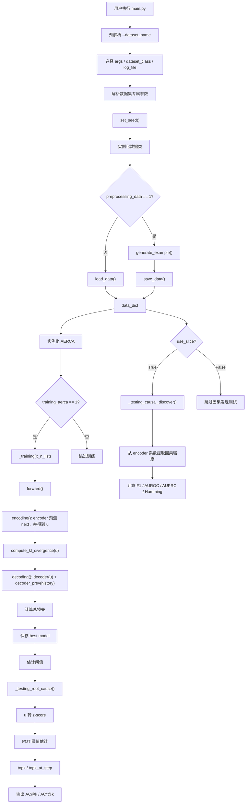

# CausalTrace RCA 项目分析

## 1. 项目概览

这个项目现在可以对外命名为 `CausalTrace RCA`，底层核心算法仍然是论文中的 `AERCA`。它是一个基于 PyTorch 的多变量时间序列根因分析项目，核心目标有两部分：

1. 通过 Granger 因果发现恢复变量之间的因果结构。
2. 在异常发生后定位异常的根因变量。

项目主入口在 `main.py`，支持以下 6 个数据集：

- `linear`
- `nonlinear`
- `lorenz96`
- `lotka_volterra`
- `swat`
- `msds`

整体流程是：

1. 根据 `--dataset_name` 选择对应参数配置和数据集类。
2. 生成或加载数据。
3. 训练 AERCA 核心模型。
4. 对合成数据做因果发现评估。
5. 对异常片段做根因定位评估。

---

## 2. 目录与模块职责

### 2.1 入口层

- `main.py`
  - 负责选择数据集、解析参数、设置日志和随机种子。
  - 负责串联数据处理、模型训练、因果发现测试和根因定位测试。

### 2.2 参数层

- `args/*.py`
  - 每个数据集都有一份专属参数文件。
  - 主要定义数据生成参数、训练超参数和评估阈值相关参数。

### 2.3 数据层

- `datasets/linear.py`
  - 生成 4 变量线性因果链数据。
  - 提供真实因果结构，适合验证因果发现和根因分析。

- `datasets/nonlinear.py`
  - 生成随机图上的非线性时间序列。
  - 因果图来自 Erdős-Rényi 随机有向图。

- `datasets/lorenz96.py`
  - 通过 Lorenz96 动力系统 ODE 积分生成数据。

- `datasets/lotka_volterra.py`
  - 通过多物种 Lotka-Volterra 动力系统生成数据。

- `datasets/swat.py`
  - 读取和清洗 SWaT 工业控制系统数据。
  - 从攻击时间段中切出异常窗口，并构造变量级标签。

- `datasets/msds.py`
  - 预处理 MSDS 指标数据。
  - 构造正常训练片段与异常测试窗口。

### 2.4 模型层

- `models/aerca.py`
  - 项目核心算法实现。
  - 同时承担训练、因果发现评估和根因定位评估。

- `models/senn.py`
  - 实现 `SENNGC`。
  - 本质是一个可学习时变系数矩阵的广义 VAR 风格网络。

### 2.5 工具层

- `utils/utils.py`
  - 提供随机种子设置、KL 散度计算、滑窗处理。
  - 提供因果发现评估指标计算。
  - 提供 POT 阈值估计和 Top-k 根因评估方法。

---

## 3. 主流程代码逻辑

主流程位于 `main.py`，可以概括为以下几步。

### 3.1 选择数据集配置

程序先做一次预解析，只读出 `--dataset_name`，然后通过一个映射表决定：

- 使用哪个参数解析器
- 使用哪个数据类
- 日志写到哪个文件
- 是否支持因果发现测试

其中：

- `linear`、`nonlinear`、`lorenz96`、`lotka_volterra` 使用 `use_slice=True`
- `swat`、`msds` 使用 `use_slice=False`

这意味着真实数据集只做根因定位，不做因果发现评估。

### 3.2 加载或生成数据

在数据类实例化之后：

- 如果 `preprocessing_data == 1`，就调用 `generate_example()` 和 `save_data()`
- 否则调用 `load_data()`

各数据类最终都会把数据写入 `data_dict`。常见字段有：

- `x_n_list`：正常时间序列
- `x_ab_list`：异常时间序列
- `label_list`：变量级异常标签
- `causal_struct`：真实因果图

### 3.3 初始化模型

主程序会根据参数创建 `AERCA` 模型实例。对外可以把它理解为 `CausalTrace RCA` 的核心建模引擎。核心超参数包括：

- `num_vars`
- `window_size`
- `hidden_layer_size`
- `num_hidden_layers`
- `lr`
- `epochs`
- `causal_quantile`
- `risk`
- `initial_level`

模型权重和阈值文件会写入 `saved_models/`。

### 3.4 模型训练

如果 `training_aerca == 1`，程序会使用正常数据训练模型：

- 合成数据集只用前 `training_size` 条正常序列训练
- 真实数据集使用全部正常训练片段训练

训练完成后，会保存最优模型，并基于验证集估计：

- 重建阈值
- encoder 根因阈值
- decoder 根因阈值

### 3.5 因果发现测试

只有 `use_slice=True` 的数据集才执行。

这里会从测试正常样本中提取 encoder 系数矩阵，得到因果强度估计，再和真实因果结构比较，输出：

- F1
- AUROC
- AUPRC
- Hamming Distance

### 3.6 根因定位测试

程序会对异常片段执行 `_testing_root_cause()`：

1. 提取 encoder 产生的隐变量残差 `u`
2. 对 `u` 做标准化，得到 z-score
3. 用 POT 算法为每个变量估计极值阈值
4. 用 `topk` 和 `topk_at_step` 计算根因定位效果

最终输出指标包括：

- `AC@1`
- `AC@3`
- `AC@5`
- `AC@10`
- `AC*@1`
- `AC*@10`
- `AC*@100`
- `AC*@500`

---

## 4. AERCA 核心模型逻辑

### 4.1 模型结构

`AERCA` 内部由 3 个 `SENNGC` 子网络组成：

- `encoder`
- `decoder`
- `decoder_prev`

它们各自作用如下：

- `encoder`
  - 使用历史窗口预测下一时刻。
  - 预测误差定义为隐变量残差 `u = pred - next`。

- `decoder`
  - 对残差序列 `u` 再建模。

- `decoder_prev`
  - 对原始历史窗口再做一次建模。

最终重建值由下面两部分组成：

```text
next_hat = decoder(u) + decoder_prev(history)
```

训练时默认还会把 `u_next` 加回去，帮助模型拟合完整动态。

### 4.2 编码阶段

`encoding()` 的流程是：

1. 对原始序列做滑窗。
2. 切出历史窗口 `winds` 和目标值 `nexts`。
3. 用 `encoder` 预测目标值。
4. 计算残差 `u = preds - nexts`。

这个残差 `u` 很关键，因为后续根因定位主要依赖它。

### 4.3 解码阶段

`decoding()` 的流程是：

1. 对残差 `u` 再做滑窗。
2. 用 `decoder` 建模残差窗口。
3. 用 `decoder_prev` 建模原始历史窗口。
4. 两者相加，得到下一时刻的重建值。

### 4.4 损失函数

训练损失由以下几项组成：

- 重建损失 `MSE`
- encoder 系数稀疏损失
- decoder 系数稀疏损失
- 系数时间平滑损失
- 残差 `u` 的 KL 正则项

含义分别是：

- 希望重建结果准确
- 希望因果系数矩阵尽量稀疏，便于恢复真实因果结构
- 希望相邻时间窗口的系数不要剧烈跳变
- 希望隐变量残差分布更规整、更稳定

### 4.5 为什么它能同时做因果发现和根因定位

这是这个项目的核心思想：

- encoder 生成的系数矩阵可以解释变量之间的影响关系，所以用来做因果发现。
- encoder 生成的残差 `u` 表示正常动力学无法解释的部分，所以用来做根因定位。

也就是说，这个项目把“结构学习”和“异常解释”放进了同一套模型里。

---

## 5. SENNGC 的工作方式

`SENNGC` 的本质是一个时变系数的广义 VAR 网络。

它的逻辑不是直接学习一个固定的系数矩阵，而是：

1. 对每个滞后阶 `k`
2. 用一个小型 MLP 读取该时刻输入
3. 输出一个 `num_vars x num_vars` 的系数矩阵
4. 再用这个系数矩阵去乘该时刻输入
5. 所有滞后阶的结果相加，得到预测值

因此它学到的是“随输入变化的因果系数”，而不是静态线性 VAR 参数。

---

## 6. 数据集逻辑总结

### 6.1 `linear`

这是最容易理解的一套数据。

正常动力学是一条 4 变量因果链：

- `x -> w -> y -> z`
- 同时每个变量还依赖自己的上一时刻

程序先生成正常样本，再随机挑选时间段和变量注入异常：

- `non_causal`：直接改噪声
- `causal`：直接改动力系统参数

这个数据集有明确真实因果图，因此可以同时评估：

- 因果发现
- 根因定位

### 6.2 `nonlinear`

先生成随机因果图，再在图上构造非线性时间序列。状态更新依赖过去 5 个时刻，并使用 `cos()` 非线性映射。异常默认通过噪声注入。

### 6.3 `lorenz96`

通过 Lorenz96 混沌系统积分得到序列，再在某些时间点对选中的变量做异常扰动。真实因果图来自 Lorenz96 的固定邻接结构。

### 6.4 `lotka_volterra`

模拟多物种捕食-被捕食系统。变量分为 prey 和 predator 两组，系统会生成正常轨迹、异常轨迹和对应标签，同时还能构造真实因果图。

### 6.5 `swat`

读取工业控制系统攻击数据，做清洗、对齐、缩放和窗口切片。最终得到：

- 正常训练片段
- 攻击窗口
- 攻击点对应的变量标签

不提供真实因果图，因此不做因果发现评估。

### 6.6 `msds`

先对指标数据做预处理，再切出正常训练片段和异常窗口，并构造标签。和 `swat` 一样，主要用于根因定位评估。

---

## 7. 模块调用关系图



---

## 8. 以 `linear` 数据集为例的一次完整运行

假设执行命令：

```bash
python main.py --dataset_name linear
```

### 8.1 参数解析

程序先根据 `dataset_name=linear` 选择：

- `args/linear_args.py`
- `datasets/linear.py`
- 日志文件 `logs/linear.log`

默认参数大致是：

- `training_size=10`
- `testing_size=100`
- `T=500`
- `num_vars=4`
- `window_size=1`
- `epochs=5000`
- `preprocessing_data=1`

### 8.2 数据生成

`Linear.generate_example()` 会生成总共 `110` 条样本：

- 前 10 条用于训练
- 后 100 条用于测试

正常序列使用如下线性动力学：

```text
x_t  <- x_{t-1}
w_t  <- w_{t-1}, x_{t-1}
y_t  <- y_{t-1}, w_{t-1}
z_t  <- z_{t-1}, w_{t-1}, y_{t-1}
```

然后再构造异常样本：

- 随机选择异常起点和异常长度
- 随机选择受影响变量
- 生成变量级标签 `label_list`

如果 `adtype='non_causal'`，异常体现在噪声上。
如果 `adtype='causal'`，异常体现在系统动力学参数上。

### 8.3 模型训练

主程序只取前 10 条正常样本训练 AERCA。

训练时每条时间序列会先做滑窗，然后：

1. encoder 预测下一时刻
2. 得到残差 `u`
3. decoder 和 decoder_prev 联合重建
4. 计算总损失
5. 反向传播

同时会使用验证集早停，并保存最优模型权重。

### 8.4 训练后阈值估计

训练结束后，程序会在验证集上估计：

- 重建误差阈值
- encoder 残差统计量
- decoder 残差统计量

这些值会保存到 `saved_models/` 中，用于测试阶段。

### 8.5 因果发现测试

程序接着对后 100 条正常测试样本做因果发现。

它会：

1. 从 encoder 的系数矩阵中提取因果强度
2. 取绝对值、中位数和最大值做聚合
3. 得到每个样本的因果图估计
4. 和真实因果图比较

最终输出：

- `Causal discovery F1`
- `Causal discovery AUROC`
- `Causal discovery AUPRC`
- `Causal discovery Hamming Distance`

### 8.6 根因定位测试

然后程序会对后 100 条异常测试样本做根因定位。

处理过程是：

1. 提取每条异常序列的隐变量残差 `u`
2. 用训练期统计量做标准化
3. 对每个变量用 POT 求异常阈值
4. 把变量按分数排序
5. 统计真实根因变量能否出现在前 k 名中

最终输出：

- `AC@1`
- `AC@3`
- `AC@5`
- `AC@10`
- `AC*@1`
- `AC*@10`
- `AC*@100`
- `AC*@500`

---

## 9. 这个项目的核心理解

这个项目不是把“异常检测”和“异常解释”拆开做，而是统一成一个可解释时序建模问题：

- 因果结构来自模型内部学到的系数矩阵
- 根因信号来自模型无法解释的残差 `u`

所以它的关键不只是“发现异常”，而是：

1. 先学正常系统动态
2. 再看哪些变量的偏离最早、最强、最无法被正常动态解释
3. 用这些偏离作为根因依据

---

## 10. 当前实现里值得注意的点

### 10.1 `encoder_alpha` 和 `decoder_alpha` 没有从入口传进模型

虽然参数文件中定义了这两个参数，但 `main.py` 初始化 `AERCA` 时没有显式传递它们，因此命令行改这两个参数目前不会生效。

### 10.2 `stride` 参数目前基本未实际使用

虽然模型构造函数里记录了 `stride`，但滑窗逻辑仍然按固定步长 1 处理。

### 10.3 根因定位主要依赖 encoder 残差

程序虽然也计算并保存了 decoder 的根因阈值，但当前根因定位测试实际只使用 encoder 侧的统计量。

---

## 11. 总结

这是一个围绕 AERCA 论文实现、对外可命名为 `CausalTrace RCA` 的研究型项目，目标非常明确：

- 在正常多变量时间序列上学习因果结构
- 在异常发生时定位真正的根因变量

项目的结构比较清晰：

- `main.py` 串主流程
- `datasets/` 负责生成或预处理数据
- `models/aerca.py` 负责核心算法
- `models/senn.py` 负责时变因果建模
- `utils/utils.py` 负责评估与阈值工具

如果后续要继续深入，最值得继续看的文件是：

- `main.py`
- `models/aerca.py`
- `models/senn.py`
- 你关心的具体数据集文件
